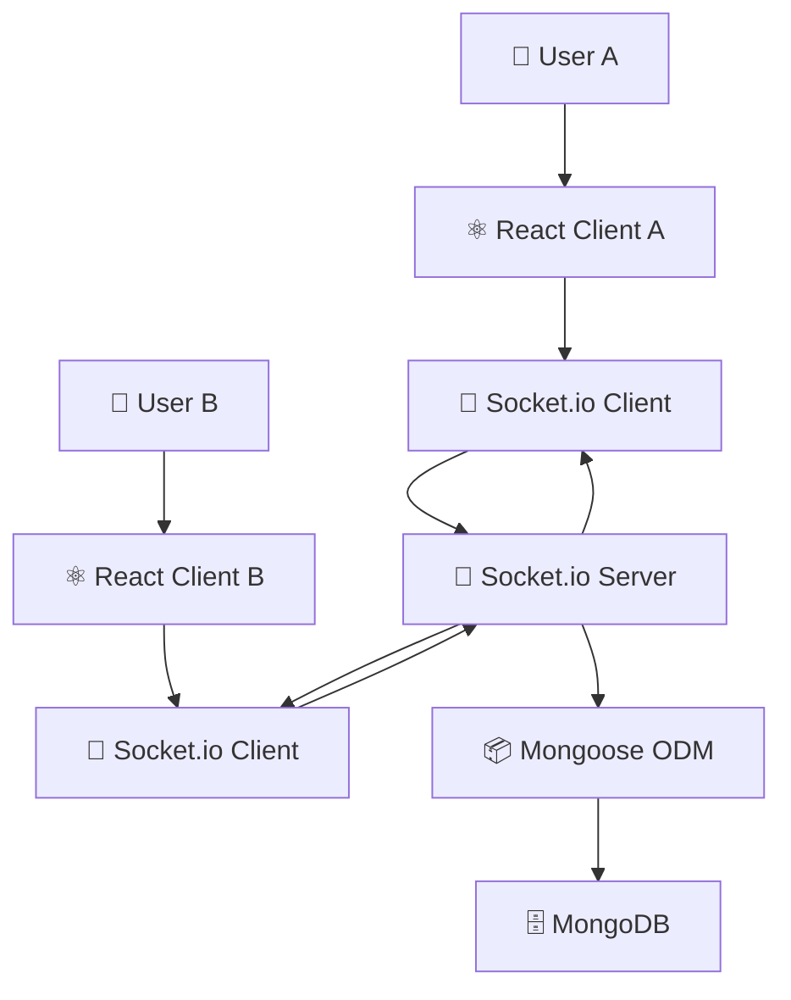

<div align="center">

# 💬 Real-Time Chat Application

**A full-stack MERN + Socket.io platform for instant messaging with persistent chat history**


</div>

---

## 📑 Table of Contents

- [Overview](#-overview)
- [Features](#-features)
- [Tech Stack](#-tech-stack)
- [Architecture](#-architecture)
- [API & Socket Events](#-api--socket-events)
- [Getting Started](#-getting-started)
- [Learning Outcomes](#-learning-outcomes)
- [Future Improvements](#-future-improvements)
- [Author](#-author)

---

## 📖 Overview

**Real-Time Chat Application** is a full-stack communication platform built using the **MERN stack** and **Socket.io**. The application enables users to exchange messages instantly while maintaining message persistence through MongoDB.

The project demonstrates WebSocket communication and real-time application development — combining the bi-directional event model of Socket.io with a REST API for message history.

---

## ✨ Features

| Feature | Description |
|---|---|
| ⚡ Real-Time Messaging | Messages delivered instantly via WebSocket |
| 🔌 Socket.io Integration | Bi-directional event-driven communication |
| 🗄️ MongoDB Message Storage | Chat history persisted across sessions |
| 🔗 REST APIs | Fetch previous messages on connect |
| ⚛️ React Frontend | Clean UI for sending and receiving messages |
| 📡 Live Communication | Both users see messages simultaneously |

---

## 🛠 Tech Stack

| Layer | Technologies |
|---|---|
| **Frontend** | React, JavaScript |
| **Backend** | Node.js, Express.js, Socket.io |
| **Database** | MongoDB, Mongoose |

---

## 🏗 Architecture



---

## 📡 API & Socket Events

### REST Endpoints

| Method | Endpoint | Description |
|---|---|---|
| `GET` | `/api/messages` | Fetch all stored messages |
| `POST` | `/api/messages` | Save a new message to the database |

### Socket.io Events

| Event | Direction | Description |
|---|---|---|
| `connection` | Server ← Client | New user connects |
| `send_message` | Server ← Client | Client sends a message |
| `receive_message` | Server → Client | Server broadcasts message to all clients |
| `disconnect` | Server ← Client | User disconnects |

```js
// Server-side Socket.io
io.on('connection', (socket) => {
  console.log('User connected:', socket.id);

  socket.on('send_message', async (data) => {
    const message = new Message(data);
    await message.save();
    io.emit('receive_message', data);
  });

  socket.on('disconnect', () => {
    console.log('User disconnected:', socket.id);
  });
});
```

---

## 🚀 Getting Started

### Prerequisites
- Node.js (v16+)
- MongoDB (local or Atlas)

### Installation

```bash
# Clone the repository
git clone https://github.com/Jeevan9898/chat-app.git
cd chat-app

# Install backend dependencies
npm install

# Set up environment variables
cp .env.example .env
# Add MONGO_URI and PORT to .env

# Start the backend server
npm run dev

# In a new terminal, install and start the frontend
cd client
npm install
npm start
```

### Environment Variables

```env
MONGO_URI=your_mongodb_connection_string
PORT=5000
```

---

## 🎓 Learning Outcomes

- Socket.io
- WebSockets
- Real-Time Communication
- Full Stack Development
- MongoDB Data Persistence

---

## 🔮 Future Improvements

- [ ] Authentication
- [ ] Private Chats
- [ ] Group Chats
- [ ] Media Sharing

---

## 👤 Author

**Jeevan Yadav**

[](https://jeevan-yadav.vercel.app/)
[](https://github.com/Jeevan9898)
